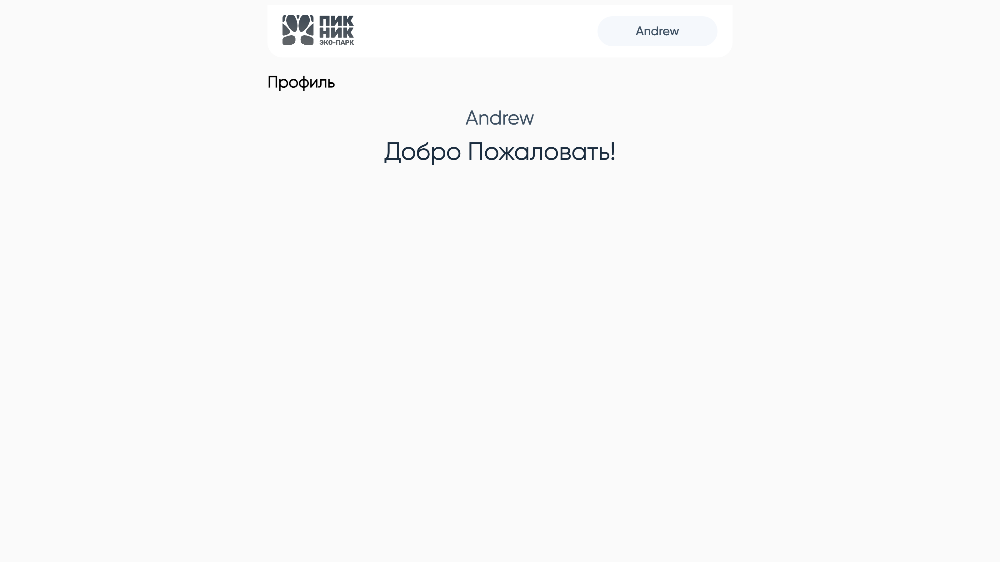

# Picnic




### Реализован функционал:

- Валидация формы;
- Клиентский роутинг;

### Установка зависимостей и сборка проекта

```
npm install
npm run build
```

### Запуск

```
cd backend
npm install
node app.js
```
